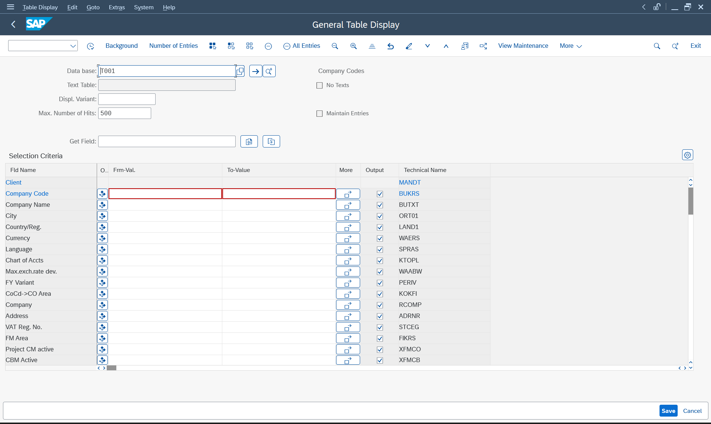

# 📘 Purchase Order Analytics Dashboard (SAP ABAP)

## 📌 Project Overview

This project is a custom SAP ABAP report developed to provide a simplified and interactive Purchase Order Analytics Dashboard for procurement teams.

The report retrieves real-time Purchase Order data, displays it in an ALV format, and allows seamless drill-down to the standard SAP transaction ME23N.

---

## 🛠 Technical Details

- **Program Name:** ZPO_ANALYTICS_DASHBOARD  
- **Module:** SAP MM (Materials Management)  
- **Development Tool:** SE38 (ABAP Report)  
- **Database Tables Used:** EKKO (Header), EKPO (Item)  
- **ALV Class Used:** CL_SALV_TABLE  
- **Database Access:** INNER JOIN  
- **Navigation Method:** SET PARAMETER ID + CALL TRANSACTION  

---

## 🎯 Project Objective

To develop a performance-optimized ABAP report that:

- Retrieves Purchase Order data company-wise
- Combines header and item details
- Displays structured ALV output
- Supports interactive drill-down to ME23N
- Follows SAP best practices for database access

---

## 🧩 Business Requirement

The procurement team required:

- Simplified PO analytics dashboard
- Filtering by Company Code, Vendor, and Date
- Real-time visibility of quantity and net value
- Quick navigation to standard SAP Purchase Order screen
- Optimized performance for large datasets

---

## Folder Structure
```
Purchase_Order_Analytics_Dashboard/
│
├── README.md
│
├── src/
│   └── ZPO_ANALYTICS_DASHBOARD.abap
│
├── screenshots/
│   ├── 01_t001_table_display.png
│   ├── 02_t001_entries_found.png
│   ├── 03_ekko_table_display.png
│   ├── 04_ekko_purchase_orders.png
│   ├── 05_selection_screen_nspl.png
│   ├── 06_alv_output.png
│   ├── 07_me23n_drilldown.png
│   └── 08_abap_program_code.png
│
└── docs/
    └── Final_Purchase_Order_Analytics_Dashboard_Documentation.pdf
```


## Screenshots

## 1. Company Code Validation (T001)




---

## 2. Purchase Order Validation (EKKO)


---

## 3. Selection Screen


---

## 4. ALV Output Report


---

## 5. Drill-Down to ME23N


---

## 6. ABAP Program Code


